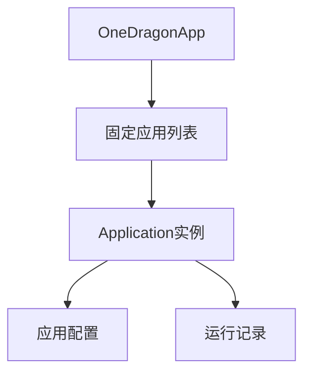
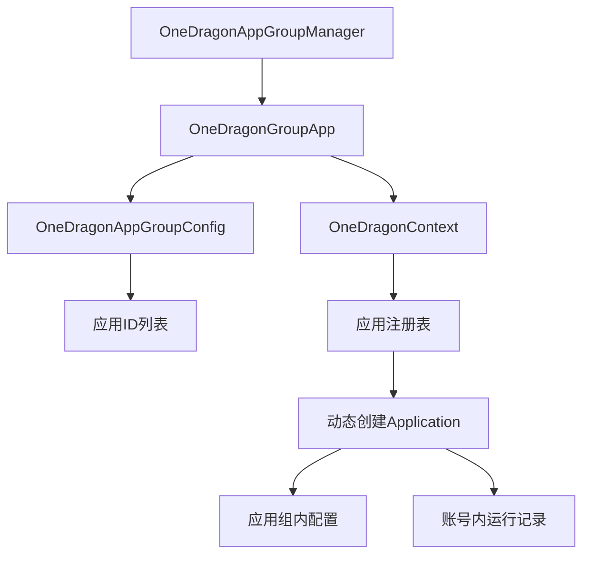

# 应用组(ApplicationGroup)设计文档

## 1. 功能概述

本文档描述了支持多应用组模式的设计方案。新的架构将允许用户创建多个应用组，每个应用组可以包含多个Application，每个Application在不同应用组中可以有独立的配置。在框架层面为后续的复杂任务编排提供基础能力。

## 2. 设计方案概述

### 2.1 核心改造内容

1. **应用注册机制**: 新增 `ApplicationFactory` 和 `ApplicationService` 用于注册和创建应用。
2. **应用组执行器**: 新增 `OneDragonGroupApp`，类似于当前的 `OneDragonApp`，用于执行一个应用组，按 `app_id` 创建应用并执行，但不负责多账号。
3. **应用组配置**: `OneDragonGroupApp` 接受一个应用组的配置 `OneDragonAppGroupConfig`，包含需运行的应用、运行顺序等。
4. **向后兼容**: 当前 `OneDragonApp` 改造为按账号执行默认应用组 `group_id=one_dragon`。
5. **分层配置**: 应用配置按 `instance_idx` 和 `group_id` 独立，可缺省使用 `group_id=one_dragon` 配置。
6. **统一运行记录**: 运行记录保持当前结构，按账号独立，不区分应用组。
7. **应用组管理**: `OneDragonAppGroupManager` 管理应用组的增删改查。

### 2.2 架构对比

#### 2.2.1 当前架构


#### 2.2.2 新架构


## 3. 核心组件设计

### 3.1 AppConfig

新增基类用于表示 `instance_idx` + `group_id` + `app_id` 的应用配置

```python
from one_dragon.base.config.yaml_operator import YamlOperator
class AppConfig(YamlOperator):
    def __init__(self, instance_idx: int, group_id: str, app_id: str):
        # 配置文件路径: config/{instance_idx}/{group_id}/{app_id}.yml
        pass
```

### 3.2 ApplicationFactory

应用工厂抽象基类，负责应用相关的内容创建

```python
class ApplicationFactory(ABC):
    
    def __init__(self, context: OneDragonContext, app_id: str):
        self.ctx = context
        self.app_id = app_id
    
    @abstractmethod
    def create_application(self) -> Application:
        """创建应用实例"""
        pass
    
    @abstractmethod
    def create_config(self, instance_idx: int, group_id: str) -> ApplicationConfig:
        """创建配置实例"""
        pass
    
    @abstractmethod
    def create_run_record(self, instance_idx: int) -> AppRunRecord:
        """创建运行记录实例"""
        pass
```

### 3.3 ApplicationService

应用服务类，负责应用注册和相关内容的创建、缓存

```python
class ApplicationService:
    
    def __init__(self, context: OneDragonContext):
        pass
    
    def get_application(self, instance_idx: int, group_id: str, app_id: str) -> Application:
        """创建应用实例 不缓存"""
        pass
    
    def get_config(self, instance_idx: int, group_id: str, app_id: str) -> ApplicationConfig:
        """获取配置实例 有缓存"""
        pass
    
    def get_run_record(self, instance_idx: int, app_id: str) -> AppRunRecord:
        """获取运行记录实例 有缓存"""
        pass
```

### 3.4 OneDragonGroupApp

继承 `Application`，用于执行一个应用组

### 3.5 OneDragonApp

按账号调用 `group_id=one_dragon` 的 OneDragonGroupApp

### 3.6 OneDragonAppGroupConfig

应用组配置类，保存在 `config/instance_idx/group_id/group.yml` 中，包含

- 应用组内有哪些应用
- 需要启动的应用
- 使用独立配置的应用
- 应用的运行顺序

### 3.7 OneDragonAppGroupConfigManager

应用组管理类，专门负责管理OneDragonAppGroupConfig的增删改查

- 默认创建应用组 `group_id=one_dragon`，无法删除。
- group_id 无法修改

## 4. 配置系统设计

### 4.1 配置文件组织结构

配置文件按照 `config/{instance_idx}/{group_id}/` 的结构组织，没有全局默认配置：

```
config/
├── 01/                             # 实例01
│   ├── one_dragon/                 # 默认应用组 (group_id=one_dragon)
│   │   ├── group.yml               # 应用组配置
│   │   ├── coffee.yml              # 咖啡应用配置 (如果在use_group_config中)
│   │   └── email.yml               # 邮件应用配置 (如果在use_group_config中)
│   ├── daily_tasks/                # 日常应用组
│   │   ├── group.yml               # 应用组配置
│   │   ├── coffee.yml              # 咖啡应用在日常应用组中的配置
│   │   └── email.yml               # 邮件应用在日常应用组中的配置
│   └── farming/                    # 体力消耗应用组
│       ├── group.yml               # 应用组配置
│       └── coffee.yml              # 咖啡应用在体力消耗组中的配置
└── 02/                             # 实例02
    └── ...
```

### 4.2 配置加载逻辑

应用配置的加载逻辑：
- 如果应用使用独立配置，加载 `config/{instance_idx}/{group_id}/{app_id}.yml`
- 否则，加载 `config/{instance_idx}/one_dragon/{app_id}.yml`

## 5. 改造计划

1. 新增 `ApplicationConfig`，改造配置类，将当前配置都迁入 `one_dragon` 应用组。
2. 实现注册机制，实现 `OneDragonGroupApp`。
3. 改造 `OneDragonApp` (包含命令行参数)。
4. 实现应用组配置和管理类。
5. 其它基于应用组的功能。
