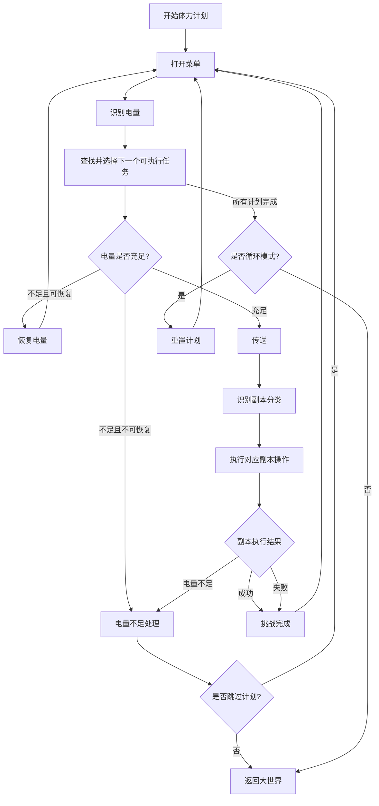

# 体力计划运行流程

## 概述

体力计划（ChargePlanApp）是一个自动化执行各种副本挑战的应用，支持实战模拟室、区域巡防、专业挑战室、恶名狩猎等多种副本类型。该应用采用基于状态机的节点图执行模式，能够智能管理电量、自动恢复电量、循环执行计划等。

## 主要流程

### 1. 初始化阶段

```
开始体力计划 → 打开菜单 → 识别电量 → 查找并选择下一个可执行任务
```

**关键逻辑**：
- 重置上次尝试的计划（`last_tried_plan = None`）
- 打开游戏菜单界面
- 识别当前剩余电量（从菜单界面的电量文本区域）
- 根据电量和计划配置选择下一个可执行的任务

### 2. 任务选择逻辑

**电量预估机制**：
- **实战模拟室**：根据卡片数量计算（`卡片数量 × 20`电量）
- **区域巡防**：固定需要60电量
- **专业挑战室**：固定需要40电量
- **恶名狩猎**：固定需要60电量
- **特殊情况**：实战模拟室默认卡片数量或区域巡防使用家政券时，需要在副本内动态检查电量

**任务筛选流程**：
1. 检查所有计划是否完成，如果完成且开启循环模式则重置计划
2. 获取下一个未完成的计划项
3. 计算所需电量并与当前电量比较
4. 如果电量不足：
   - 配置了恢复电量：触发恢复电量流程
   - 未配置恢复电量且允许跳过：跳过当前计划继续下一个
   - 未配置恢复电量且不允许跳过：结束本轮计划
5. 如果电量充足：计算可运行次数并设置为下一个执行计划

### 3. 传送与副本执行

```
传送 → 识别副本分类 → [具体副本操作] → 挑战完成
```

**传送阶段**：
- 使用快捷手册传送到指定副本位置
- 根据计划配置的标签页、分类、副本类型进行精确传送

**副本分类识别**：
- 根据传送结果识别当前副本类型
- 分发到对应的副本处理节点

### 4. 各副本类型的电量处理逻辑

#### 4.1 实战模拟室（CombatSimulation）

**电量检查流程**：
```
等待入口加载 → 选择类型/副本 → 选择卡片数量 → 识别电量 → 恢复电量/下一步
```

**电量识别逻辑**：
- 如果`need_check_power=False`：直接使用预计算的运行次数
- 如果`need_check_power=True`：
  - 从界面识别"剩余电量"和"需要电量"
  - 计算实际可运行次数：`can_run_times = charge_left // charge_need`
  - 与计划需要次数比较，取较小值

**电量不足处理**：
- 检查恢复电量配置，如果允许则调用恢复电量操作
- 否则返回电量不足状态，由上层处理

#### 4.2 区域巡防（AreaPatrol）

**电量检查流程**：
```
等待入口加载 → 处理家政券 → 识别电量 → 恢复电量/下一步
```

**家政券处理**：
- 如果配置使用家政券，先尝试使用家政券
- 家政券使用失败或不使用家政券时，进入电量识别

**电量识别逻辑**：
- 与实战模拟室相同的识别和计算逻辑
- 从"区域巡防"界面的电量显示区域进行OCR识别

#### 4.3 专业挑战室（ExpertChallenge）

**电量检查流程**：
```
等待入口加载 → 关闭燃竭模式 → 识别电量 → 恢复电量/下一步
```

**特殊处理**：
- 自动关闭深度追猎模式（燃竭模式）
- 电量识别逻辑与其他副本相同

#### 4.4 恶名狩猎（NotoriousHunt）

**电量检查流程**：
```
等待入口加载 → 选择副本 → 选择深度追猎模式 → 识别可运行次数
```

**深度追猎模式**：
- 根据`use_charge_power`参数决定是否使用深度追猎
- 深度追猎模式下需要消耗电量，普通模式使用免费次数

**电量识别逻辑**：
- **深度追猎模式**：识别剩余电量和需要电量，计算可运行次数
- **普通模式**：识别剩余免费次数

### 5. 战斗执行流程

```
选择预备编队 → 出战 → 加载自动战斗指令 → 等待战斗画面 → 自动战斗 → 战斗结束 → 判断下一次
```

**通用战斗流程**：
1. **选择预备编队**：根据计划配置选择指定编队
2. **出战**：点击出战按钮进入战斗
3. **加载自动战斗指令**：根据编队或计划配置加载对应的自动战斗脚本
4. **等待战斗画面**：等待战斗界面完全加载
5. **自动战斗**：执行自动战斗逻辑，监控战斗状态
6. **战斗结束**：战斗完成后更新运行次数
7. **判断下一次**：根据剩余次数决定是否继续战斗

### 6. 电量不足处理

**电量不足触发条件**：
- 各副本操作返回`STATUS_CHARGE_NOT_ENOUGH`状态
- 传送失败（如找不到代理人方案培养）

**处理策略**：
- **跳过计划模式**：标记当前计划为已尝试，继续查找下一个计划
- **非跳过模式**：直接结束本轮计划执行

### 7. 电量恢复机制

**恢复电量触发**：
- 在任务选择阶段检测到电量不足且配置了恢复电量
- 各副本内检测到电量不足且配置了恢复电量

**恢复电量逻辑**：
- 调用`RestoreCharge`操作
- 支持在菜单界面和副本界面的电量恢复
- 恢复成功后继续执行，失败则按电量不足处理

### 8. 循环与结束

**循环条件**：
- 配置了循环模式（`loop=True`）
- 所有计划执行完成后自动重置并继续

**结束条件**：
- 所有计划完成且未配置循环模式
- 电量不足且无法恢复
- 出现不可恢复的错误

**结束处理**：
```
返回大世界 → 保存通知截图 → 发送完成通知
```

## 状态流转图



## 关键特性

1. **智能电量管理**：预估电量需求，动态检查实际消耗
2. **灵活的恢复机制**：支持多种电量恢复策略
3. **容错处理**：支持计划跳过、重试机制
4. **循环执行**：支持计划完成后自动重置循环
5. **多副本支持**：统一的流程框架适配不同副本类型
6. **状态持久化**：记录执行进度，支持断点续传
