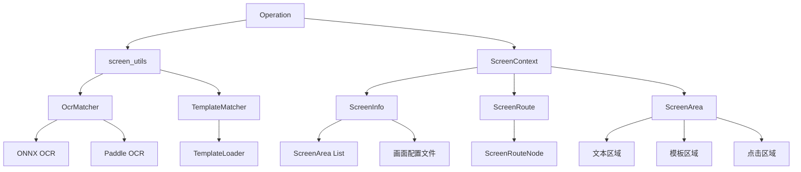
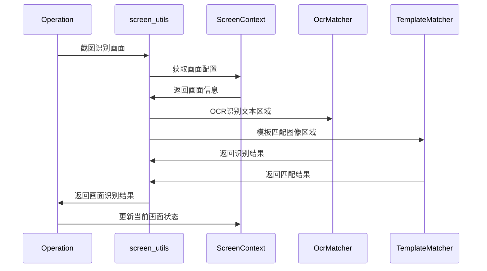

# OneDragon 画面识别与跳转机制设计文档

## 1. 概述

OneDragon 框架提供了一套完整的画面识别与跳转机制，用于游戏自动化中的界面导航和状态判断。该机制基于多种识别技术，支持复杂的画面间跳转路径规划，是整个自动化框架的核心组件之一。

### 1.1 设计目标

- **准确性**：提供高精度的画面识别能力
- **灵活性**：支持多种识别方式（OCR、模板匹配等）
- **智能化**：自动规划画面间的最优跳转路径
- **可配置性**：通过配置文件管理画面和区域信息
- **可扩展性**：支持新游戏的画面配置扩展

### 1.2 核心特性

- 基于区域的画面识别机制
- 多种识别技术融合（OCR、模板匹配、特征匹配）
- Floyd算法实现的最短路径跳转
- 画面状态缓存和优化搜索
- 可视化的画面配置管理

## 2. 整体架构

### 2.1 核心组件关系



### 2.2 数据流向



## 3. 画面识别机制

### 3.1 画面定义结构

#### 3.1.1 ScreenInfo（画面信息）
- **screen_id**: 画面唯一标识符
- **screen_name**: 画面显示名称
- **screen_image**: 画面截图样本
- **pc_alt**: PC端是否需要ALT键辅助点击
- **area_list**: 画面包含的区域列表

#### 3.1.2 ScreenArea（画面区域）
- **area_name**: 区域名称
- **pc_rect**: 区域坐标矩形
- **text**: 文本识别内容（文本区域）
- **template_id**: 模板标识（模板区域）
- **id_mark**: 是否为画面唯一标识区域
- **goto_list**: 点击后可能跳转的画面列表
- **color_range**: 颜色筛选范围

### 3.2 识别技术

#### 3.2.1 OCR文本识别
```python
# 基于ONNX的OCR识别
class OnnxOcrMatcher(OcrMatcher):
    def run_ocr(self, image: MatLike, threshold: float = 0) -> dict[str, MatchResultList]:
        # 对图片进行OCR识别，返回文本及其位置信息
        
    def match_words(self, image: MatLike, words: List[str]) -> dict[str, MatchResultList]:
        # 在图片中查找指定关键词
```

**特点**：
- 支持中英文混合识别
- 可配置识别阈值
- 支持颜色范围筛选
- 基于LCS算法的模糊匹配

#### 3.2.2 模板匹配
```python
class TemplateMatcher:
    def match_template(self, source: MatLike, template_sub_dir: str, 
                      template_id: str, threshold: float = 0.5) -> MatchResultList:
        # 在原图中匹配模板图像
```

**特点**：
- 基于OpenCV的模板匹配
- 支持掩码匹配
- 可配置匹配阈值
- 支持特征点匹配

#### 3.2.3 特征匹配
```python
def match_one_by_feature(self, source: MatLike, template_sub_dir: str,
                        template_id: str, knn_distance_percent: float = 0.7) -> MatchResult:
    # 使用SIFT/ORB特征点进行匹配
```

**特点**：
- 对缩放和旋转具有鲁棒性
- 适用于复杂背景下的匹配
- 基于KNN距离的匹配筛选

### 3.3 画面识别流程

#### 3.3.1 单画面识别
```python
def is_target_screen(ctx: OneDragonContext, screen: MatLike, 
                    screen_name: str) -> bool:
    """判断当前截图是否为目标画面"""
    screen_info = ctx.screen_loader.get_screen(screen_name)
    
    # 检查所有标识区域
    for area in screen_info.area_list:
        if area.id_mark:  # 画面唯一标识区域
            if not find_area_in_screen(ctx, screen, area):
                return False
    return True
```

#### 3.3.2 最佳画面匹配
```python
def get_match_screen_name(ctx: OneDragonContext, screen: MatLike) -> str:
    """从所有画面中找到最匹配的画面"""
    # 优先从上次记录的画面开始搜索（BFS）
    if ctx.screen_loader.current_screen_name:
        return get_match_screen_name_from_last(ctx, screen)
    
    # 遍历所有画面进行匹配
    for screen_info in ctx.screen_loader.screen_info_list:
        if is_target_screen(ctx, screen, screen_info.screen_name):
            return screen_info.screen_name
```

## 4. 画面跳转机制

### 4.1 跳转路径数据结构

#### 4.1.1 ScreenRouteNode（跳转节点）
```python
class ScreenRouteNode:
    def __init__(self, from_screen: str, from_area: str, to_screen: str):
        self.from_screen = from_screen    # 起始画面
        self.from_area = from_area        # 点击区域
        self.to_screen = to_screen        # 目标画面
```

#### 4.1.2 ScreenRoute（跳转路径）
```python
class ScreenRoute:
    def __init__(self, from_screen: str, to_screen: str):
        self.from_screen = from_screen
        self.to_screen = to_screen
        self.node_list = []  # 跳转节点序列
```

### 4.2 路径规划算法

#### 4.2.1 Floyd最短路径算法
```python
def init_screen_route(self):
    """使用Floyd算法计算任意两个画面间的最短路径"""
    # 1. 初始化所有画面对的路径
    for screen_1 in self.screen_info_list:
        for screen_2 in self.screen_info_list:
            self.screen_route_map[screen_1.screen_name][screen_2.screen_name] = ScreenRoute(...)
    
    # 2. 根据goto_list建立直接连接
    for screen_info in self.screen_info_list:
        for area in screen_info.area_list:
            for goto_screen in area.goto_list:
                # 添加直接跳转边
                
    # 3. Floyd算法计算最短路径
    for k in range(screen_len):
        for i in range(screen_len):
            for j in range(screen_len):
                # 如果 i->k->j 比 i->j 更短，则更新路径
```

#### 4.2.2 路径优化策略
- **缓存机制**：缓存已计算的路径，避免重复计算
- **BFS搜索**：从当前画面开始的广度优先搜索
- **路径长度优化**：选择跳转步数最少的路径

### 4.3 跳转执行流程

#### 4.3.1 画面跳转操作
```python
def round_by_goto_screen(self, screen_name: str) -> OperationRoundResult:
    """从当前画面跳转到目标画面"""
    # 1. 识别当前画面
    current_screen = get_match_screen_name(self.ctx, screen)
    
    # 2. 检查是否已在目标画面
    if current_screen == screen_name:
        return self.round_success()
    
    # 3. 获取跳转路径
    route = self.ctx.screen_loader.get_screen_route(current_screen, screen_name)
    
    # 4. 执行第一步跳转
    first_node = route.node_list[0]
    return self.round_by_find_and_click_area(screen, current_screen, first_node.from_area)
```

#### 4.3.2 区域查找与点击
```python
def find_and_click_area(ctx: OneDragonContext, screen: MatLike, 
                       screen_name: str, area_name: str) -> OcrClickResultEnum:
    """在画面中找到指定区域并点击"""
    area = ctx.screen_loader.get_area(screen_name, area_name)
    
    if area.is_text_area:
        # OCR识别并点击
        return ocr_click_logic(ctx, screen, area)
    elif area.is_template_area:
        # 模板匹配并点击
        return template_click_logic(ctx, screen, area)
    else:
        # 直接点击区域中心
        return direct_click_logic(ctx, area)
```

## 5. 配置管理

### 5.1 画面配置文件结构
```yaml
# screen_info/{screen_id}.yml
screen_id: "main_menu"
screen_name: "主菜单"
pc_alt: false
area_list:
  - area_name: "开始游戏"
    id_mark: true
    pc_rect: [100, 200, 300, 250]
    text: "开始游戏"
    lcs_percent: 0.8
    goto_list: ["game_lobby"]
  - area_name: "设置按钮"
    pc_rect: [400, 50, 450, 100]
    template_sub_dir: "ui"
    template_id: "settings_icon"
    template_match_threshold: 0.7
    goto_list: ["settings_menu"]
```

### 5.2 模板文件组织
```
assets/
├── template/
│   ├── ui/
│   │   ├── settings_icon/
│   │   │   ├── raw.png        # 原始模板图
│   │   │   ├── mask.png       # 掩码图（可选）
│   │   │   └── config.yml     # 模板配置
│   │   └── ...
│   └── ...
└── game_data/
    └── screen_info/
        ├── main_menu.yml
        ├── main_menu.png
        └── ...
```

## 6. 性能优化

### 6.1 识别优化
- **ROI裁剪**：只对感兴趣区域进行识别
- **缓存机制**：缓存模板和OCR结果
- **并行处理**：多线程并行识别多个区域
- **阈值调优**：根据实际效果调整识别阈值

### 6.2 路径优化
- **状态缓存**：记录当前和上一个画面状态
- **智能搜索**：优先搜索相邻画面
- **路径预计算**：启动时预计算所有路径

### 6.3 内存管理
- **懒加载**：按需加载模板和画面配置
- **资源释放**：及时释放不再使用的图像资源
- **对象池**：重用频繁创建的对象

## 7. 扩展机制

### 7.1 新游戏适配
1. 创建游戏特定的画面配置文件
2. 准备模板图像和掩码
3. 配置画面间的跳转关系
4. 测试和调优识别参数

### 7.2 识别算法扩展
1. 继承OcrMatcher或TemplateMatcher基类
2. 实现特定的识别算法
3. 注册到OneDragonContext中
4. 在画面配置中指定使用的算法

### 7.3 跳转策略扩展
1. 继承ScreenContext类
2. 重写路径规划算法
3. 实现自定义的跳转逻辑
4. 配置特殊的跳转规则

## 8. 使用示例

### 8.1 基本画面识别
```python
# 在Operation中识别当前画面
def check_current_screen(self) -> OperationRoundResult:
    screen = self.screenshot()
    current_screen_name = self.check_and_update_current_screen(screen)

    if current_screen_name == "目标画面":
        return self.round_success()
    else:
        return self.round_retry(f"当前画面: {current_screen_name}")
```

### 8.2 区域查找与点击
```python
# 查找并点击指定区域
def click_start_button(self) -> OperationRoundResult:
    return self.round_by_find_and_click_area(
        screen_name="主菜单",
        area_name="开始游戏",
        success_wait=2.0,
        retry_wait=1.0
    )
```

### 8.3 画面跳转
```python
# 从当前画面跳转到目标画面
def goto_settings(self) -> OperationRoundResult:
    return self.round_by_goto_screen(
        screen_name="设置菜单",
        success_wait=1.0,
        retry_wait=1.0
    )
```

### 8.4 OCR文本识别
```python
# 在指定区域识别文本
def check_level_text(self) -> OperationRoundResult:
    screen = self.screenshot()
    area = self.ctx.screen_loader.get_area("角色界面", "等级显示")

    return self.round_by_ocr(
        screen=screen,
        target_cn="等级",
        area=area,
        lcs_percent=0.8
    )
```

## 9. 最佳实践

### 9.1 画面配置设计原则
1. **唯一标识**：每个画面至少有一个id_mark=true的区域
2. **区域命名**：使用描述性的区域名称，便于理解和维护
3. **阈值设置**：根据实际测试效果调整识别阈值
4. **跳转关系**：准确配置goto_list，确保路径规划正确

### 9.2 识别优化建议
1. **颜色筛选**：对于特定颜色的文本，使用color_range提高识别精度
2. **模板质量**：使用高质量的模板图像，避免背景干扰
3. **区域大小**：合理设置识别区域大小，避免过大或过小
4. **多重验证**：对关键画面使用多个标识区域提高可靠性

### 9.3 性能优化技巧
1. **缓存利用**：充分利用画面状态缓存，减少重复识别
2. **并行处理**：对独立的识别任务使用多线程处理
3. **资源管理**：及时释放大图像对象，避免内存泄漏
4. **算法选择**：根据场景选择合适的识别算法

## 10. 故障排除

### 10.1 常见问题
1. **画面识别失败**
   - 检查id_mark区域配置是否正确
   - 验证识别阈值设置是否合适
   - 确认模板图像质量是否良好

2. **跳转路径错误**
   - 检查goto_list配置是否完整
   - 验证画面间的连接关系
   - 重新初始化路径规划

3. **点击位置不准确**
   - 调整区域坐标设置
   - 检查OCR识别结果的准确性
   - 验证模板匹配的精度

### 10.2 调试工具
1. **截图保存**：使用save_screenshot保存调试截图
2. **日志输出**：启用详细日志查看识别过程
3. **可视化工具**：使用画面配置工具查看区域标注
4. **性能监控**：监控识别耗时和成功率

## 11. 技术细节

### 11.1 坐标系统
- 使用屏幕坐标系，原点在左上角
- 矩形定义：[x1, y1, x2, y2]（左上角和右下角坐标）
- 点击坐标：默认使用区域中心点

### 11.2 线程安全
- OCR识别器支持并发调用
- 模板匹配器线程安全
- 画面状态更新使用原子操作

### 11.3 错误处理
- 识别失败时返回明确的错误码
- 支持重试机制和超时控制
- 提供详细的错误信息和调试数据

---

本文档详细介绍了OneDragon框架中画面识别与跳转机制的设计原理、实现方式和使用方法，为框架的进一步开发和游戏适配提供技术指导。通过合理的配置和优化，该机制能够为游戏自动化提供稳定可靠的画面导航能力。
